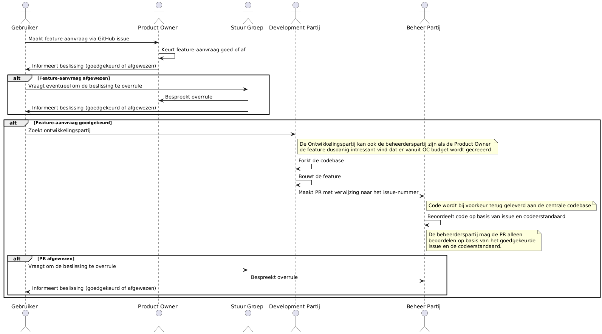

# Aan de slag met development

We gaan er voor deze stap vanuit dat je reeds een werkende lokale Nextcloud-omgeving hebt met daarin de code voor de app, heb je die nog niet kijk dan eerst onder Installatie van [Nextcloud Demo/Test-omgeving](installatie-van-nextcloud-demo-test-omgeving.md) of[ Installatie van Nextcloud Development](../installatie/instructies.md)-omgeving

## Bijdragen

Als Nextcloud-app volgen we sowieso de [Nextcloud publishing guidelines](https://docs.nextcloud.com/server/19/developer\_manual/app/publishing.html#app-guidelines).

Daarbovenop hanteren we een aantal extra spelregeles:

* **Features moeten zijn voorzien van gebruikersdocumentatie**
* **Backend code moet zijn voorzien van automatische tests**: Code die coverage van het project verlaagd wordt niet geaccepteerd, zie ook [PHP-unit testing](https://docs.nextcloud.com/server/latest/developer\_manual/server/unit-testing.html).
* **Backend code moet zuiver zijn**: Code mag _géén_ linting errors bevaten
* **Frontend code moet zijn voorzien van automatische tests**: Code die coverage van het project verlaagd wordt niet geaccepteerd
* **Frontend code moet zuiver zijn**: Code mag _géén_ linting errors bevaten
* **Seperation of concerns**: Voor zowel backend als frontend moet business logic zijn opgenomen in Services. Dat betekend dat Controllers, Templates, Views, Components en Store _géén_ business logic mogen bevatten.
* **Vier ogen principe**: Pull requests moeten zijn beoordeeld door een andere developer dan de maker voordat ze worden geaccepteerd
* **Automatische test**: Code mag alleen naar master/main als alle automatische tests goed gaan
* **Vraag gestuurde development**: Code wordt alleen geacepteerd als deze is gekopeld aan een door de PO goed gekeurde user story ([regel](https://github.com/OpenCatalogi/.github/issues/new/choose) die dus eerst)

## Feature flow
In de meeste gevallen zal een wijzigings voorstel voor de open catalogi nextcloud app voortkomen vanuit de PO owner van Open Catalogi ([Core](https://documentatie.opencatalogi.nl/Docs/Projecten/)) of de product owner van een van de [projecten](https://documentatie.opencatalogi.nl/Docs/Projecten/). Maar feitenlijk kan iedere gebruiker een feature request indienen.

De Ontwikkelpartijen van [Core](https://documentatie.opencatalogi.nl/Docs/Projecten/) fungeren tevens als beheer partijen voor de code base.



## Application development

Omdat de applicatie is ontwikkeld met Nextcloud, is er uitgebreide informatie te vinden in de [Nextcloud-documentatie](https://docs.nextcloud.com/server/latest/developer\_manual/index.html) zelf. Dit geldt zowel voor de lay-out van de app als voor de vele componenten die eraan toegevoegd kunnen worden. Tijdens de ontwikkeling van de OpenCatalogi-app is het _documentation-first_ principe gehanteerd, waarbij de ontwikkelaars eerst de [ Nextcloud-documentatie](https://docs.nextcloud.com/server/latest/developer\_manual/index.html) hebben geraadpleegd.

## Kwaliteit, Stabilitiet en Veiligheid
Als onderdeel van de CI/CD straat voeren we een aantal tests uit, hiermee handhaven we zowel de code quility eisen van nextcloud als die van onzelf. Deze test worden geborgt in een workflow zodat je de resultaten zelf op iedere commit ziet. Let op! het falen van deze tests betekend dat de code niet naar master/main kan worden gemerged en dus niet in productie kan worden genomen. 

### Voor de kwaliteit van de code maken we gebruik van linters
Voor frontend is dat:

```cli
$ npm run lint
```


Voor php de backend is dat:

```cli
$ ???
```

Voor bijde geld dat het aantal acceptabele errors 0 is.

## Voor stabilliteit gebruiken we unit tests
Voor frontend is dat:

```cli
$ npm run test-coverage
```


Voor php de backend is dat:

```cli
$ ???
```

Voor bijde geld dat minimale test covaradge 80% is, en het aantal acceptabele errors 0.


## Voor veiligheid gebruiken we dependency scanning
Voor frontend is dat:

```cli
$ npm audit
```


Voor php de backend is dat:

```cli
$ ???
```


Voor bijde geld dat het aantal acceptabele critcal vulnurabilities 0 is.


### Gebruikers documentatie

We gebruiken Gitbook voor de gebruikers documentatie, features binnen de app zouden zo veel mogelijk direct moeten doorverwijzen naar deze documentatie.

Ook voor de documentatie wordt een linter gerbuikt namenlijk 

## API Development

De ontwikkeling van de API wordt bijgehouden met de documentatietool [Stoplight.io](https://stoplight.io/), die automatisch een [OpenAPI Specificatie (OAS)](https://www.noraonline.nl/wiki/FS:Openapi-specification#:~:text=Een%20OpenAPI%20Specification%20(OAS)%20beschrijft,er%20achter%20de%20API%20schuilgaat.) genereert uit de documentatie. De Stoplight voor OpenCatalogi is [hier](https://conduction.stoplight.io/docs/open-catalogi/6yuj08rgf7w44-open-catalogi-api) te vinden.

## Frontend Development

### Typing, Storage en Typing

Om gegevens deelbaar te maken tussen de verschillende Vue-componenten maken we gebruik van [statemanagement](https://vuejs.org/guide/scaling-up/state-management) waarbij we het Action, State, View patroon van Vue zelf volgen. Omdat de applicatie ingewikkelder begint te worden stappen we daarbij over van [simple state management](https://vuejs.org/guide/scaling-up/state-management#simple-state-management-with-reactivity-api) naar [Pinia](https://pinia.vuejs.org/), de door Vue zelf geadviseerde opvolger van [Vuex](https://vuejs.org/guide/scaling-up/state-management#pinia).

Omdat Pinia vanuit zichzelf al typing ondersteund en daarop testbaar is vervalt daarmee ook de noodzaak om in de voorkant te werken met Typescript, de ontwikkeling daarvan is dan ook gestopt.

### Modals

* Er mag altijd slechts één modal actief zijn.
* Modals moeten abstract en overal bereikbaar zijn.
* Modals moeten geplaatst worden in de map src/modals.
* Modals moeten getriggerd worden via de state.
* Modals moeten geïmporteerd worden via `/src/modals/Modals.vue`.


### Views

* Views moeten dezelfde bestandsnaam hebben als de geëxporteerde naam en een correlatie hebben met de map waarin het bestand zich bevindt.
* Bijvoorbeeld, als het bestand een detailpagina is en het zich in de map `publications` bevindt, moet het bestand de naam `PublicationDetail.vue` hebben.

## Documentatie
- [Icons](https://pictogrammers.com/library/mdi/)
- [Layout](https://docs.nextcloud.com/server/latest/developer_manual/design/layout.html)-
- [Componenten](https://nextcloud-vue-components.netlify.app/)