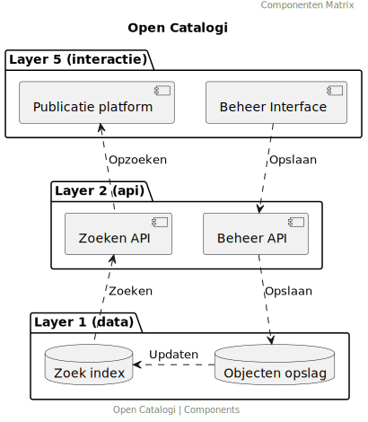

# Componenten

## Basis Componenten
In de kern bestaat Open Catalogi uit een viertal basis componenten

- Een _publicatie platform_ waarin de burger kan zoeken
- Een _beheer interface_ waarin medewerkers publicaties en configuratie kunnen beheren
- Een _beheer API_ die de beheer interfae faciliteerd
- Een _zoeken API_ de het publicaite platform faciliteerd

De beide API's maken daarbij gebruik van data opslag, in de meest simpele vorm is dat 
- _Objecten opslag_ voor publicaties, metadata over documenten, thema's, catalogi etc
- _Zoek Index_ voor het lezen van zoeken functionaliteit 

Vanuit de architectuur doen we geen uitspraken over de dataopslag behalve dat er een harde scheiding moet zijn tussen de opslag van behandelgegevens (Objecten opslag) waar ook niet publieke informatie in kan voorkomen en de zoekgegevens (Zoek index) waarin alleen publieke informatie mag voorkomen.

## Invulling van de Componenten
Bovenstaande abstracte componenten behoeven natuurlijk een concrete invulling, daarvoor heeft Open Catalogi een aantal open source oplossingen geraliseerd of hergebruikt.

| Component | Invulling |
| ----------- | ----------- |
| _publicatie platform_ | [NlDesign app](https://github.com/OpenCatalogi/web-app) |
| _beheer interface_ | [NextCloud app](https://github.com/ConductionNL/opencatalogi) |
| _beheer API_ | [NextCloud app](https://github.com/ConductionNL/opencatalogi) |
| _zoeken API_ | [NextCloud app](https://github.com/ConductionNL/opencatalogi) |
| _Objecten opslag_ | [mongodb](https://github.com/mongodb/mongo) of [Objects API](https://github.com/maykinmedia/objects-api) |
| _Zoek Index_ |  [Elastic Search](https://github.com/elastic/elasticsearch) |

Daarnaast hebben diverse projecten zo als de software catalogus en open woo hun eigen aanvullende over vervangende componenten gerealiseerd. Kijk daarvoor bij [projecten](Projecten).

## Data Opslag
Hoewel erg geen architecturele eis is, met betrekking tot hoe documenten en objecten worden opgeslagen, kiezen we er zelf bij de uitvoering voor om documenten (bestanden) en gegevens over documenten de scheiden. Voornaamste overweging hierbij is dat de documenten een spel apart zijn dat je graag in een [DMS](https://en.wikipedia.org/wiki/Document_management_system) speelt.

Daarmee word de structuur zo als we die doorgaans zien 

## Scheiding van architectuur en uitvoering
Vanuit commonground plaatsen we binnen [het 5 lagen model](https://componentencatalogus.commonground.nl/5-lagen-model) API's als losse laag en teken we ze in als losse [application components ](https://pubs.opengroup.org/architecture/archimate301-doc/chap09.html#_Toc489946066). 

We zelf Open Catalogi als [application collaboration](https://pubs.opengroup.org/architecture/archimate301-doc/chap09.html#_Toc489946067) bestaande uit  hanteren we één next cloud applicatie die beide api's kan uitleveren, hiermee laten we de keuze aan overheden of zij wel of geen losse installatie willen per API. Hoewel een functionele scheiding tussen de API's dus mogenlijk is, zien wij beide api's als één applicatie component dat naast de API's ook een (technisch) beheers interface, logging en andere randvoorwaardenlijke functionaliteiten voor haar rekening neemt. Hiermee lijnen we uit op andere commonground applicaties zo als [open zaak](https://openzaak.org/).

## Alternatieve naamgeving van componenten en applicaties
Vanuit commonground maken we een verschil tussen architecturele componenten (API's databases etc) en installeerbare componenten. Een goed voorbeeld hiervan is [open zaak](https://openzaak.org/) waarbij één applicatie meerdere

- Open Index (Zoeken API + Zoek Index)
- Open Registers (Beheer API + Objecten Api)

Vanuit Dimpact start archit

Afgelopen maand is de architectuur meer uitgeleind rondom het concept publicatie en het event publiceren. Daarmee lijkt het nu voor meer voor de hand te liggen om het te hebben over een "Publicatie Register" die kan worden benaderd via een publicatie API.

